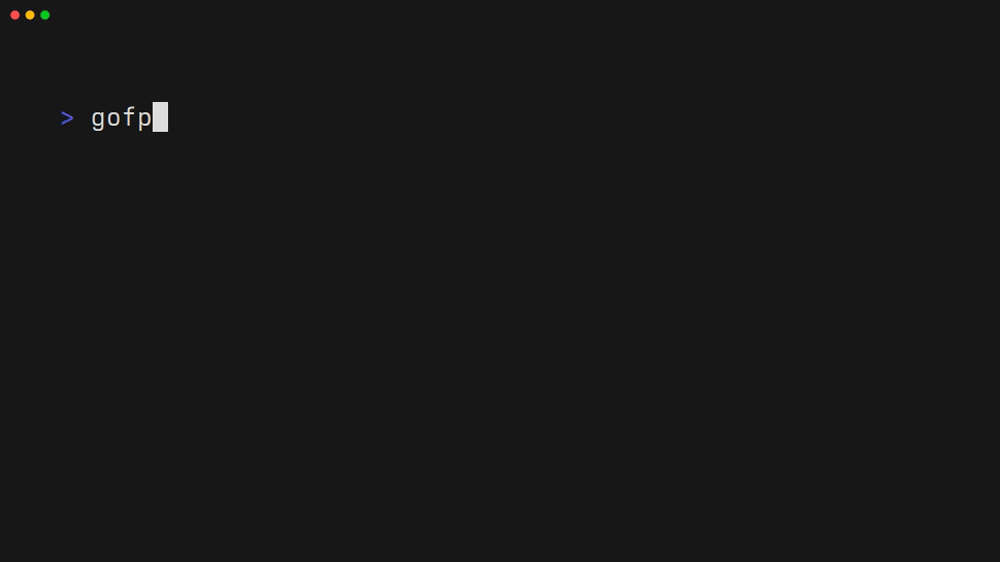

# gofp
A simple tool for quickly finding projects.



## Installation
```sh
go install github.com/gabefiori/gofp/cmd/gofp@latest
```

## Configuration
Create a configuration file at `~/.config/gofp/config.json`:

```json
{
  "sources": [
    {
      "path": "~/your/path",
      "depth": 1
    },
    {
      "path": "/home/you/your_other/path",
      "depth": 3
    }
  ],

  "expand_output": true
}
```

> **Note:** `"expand_output"` is optional and defaults to `true`.

## Using with cd

### bash/zsh
To use `gofp` with the `cd` command, you can add the following function to your `.bashrc` or `.zshrc` file:

```sh
function fp() {
    cd "$(gofp)"
}
```

After adding this function, make sure to reload your shell configuration by running:

```sh
source ~/.bashrc  # For bash
# or
source ~/.zshrc   # For zsh
```

### fish
For Fish shell users, you can define the function in your configuration file (usually `~/.config/fish/config.fish`) as follows:

```fish
function fp
    cd (gofp)
end
```
After adding this function, you can either restart your terminal or run `source ~/.config/fish/config.fish` to apply the changes

## Using with tmux
You can utilize this [script](/scripts/gofp-tmux.sh), which enables you to easily attach to or switch between Tmux sessions using the gofp command for selection.

To set it up, you can:
```sh
sudo wget -O /usr/local/bin/tms https://raw.githubusercontent.com/gabefiori/gofp/refs/heads/main/scripts/gofp-tmux.sh
sudo chmod +x /usr/local/bin/tms
```
